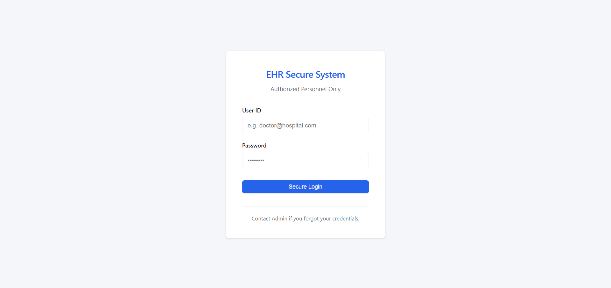
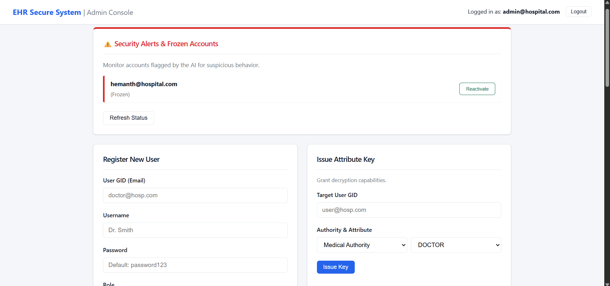
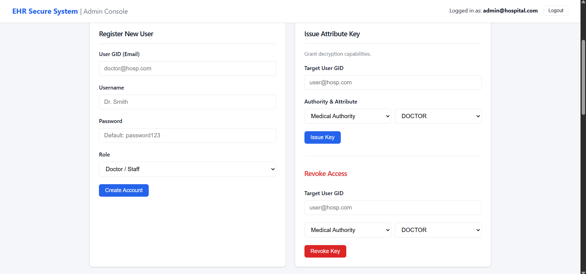
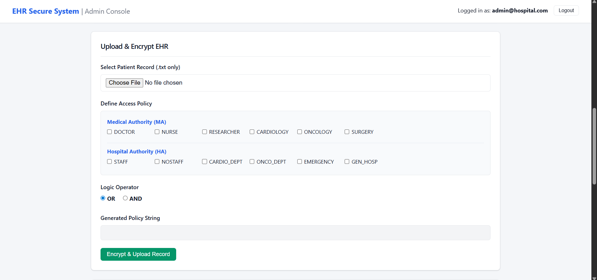
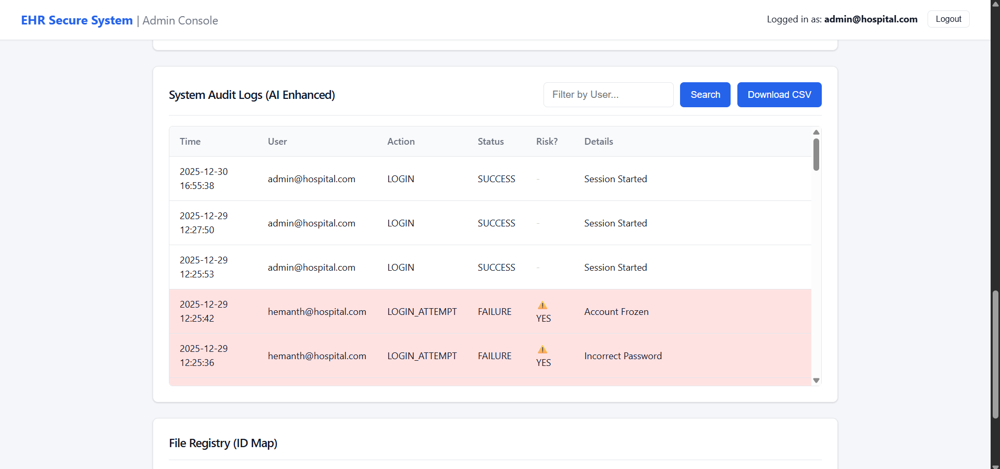
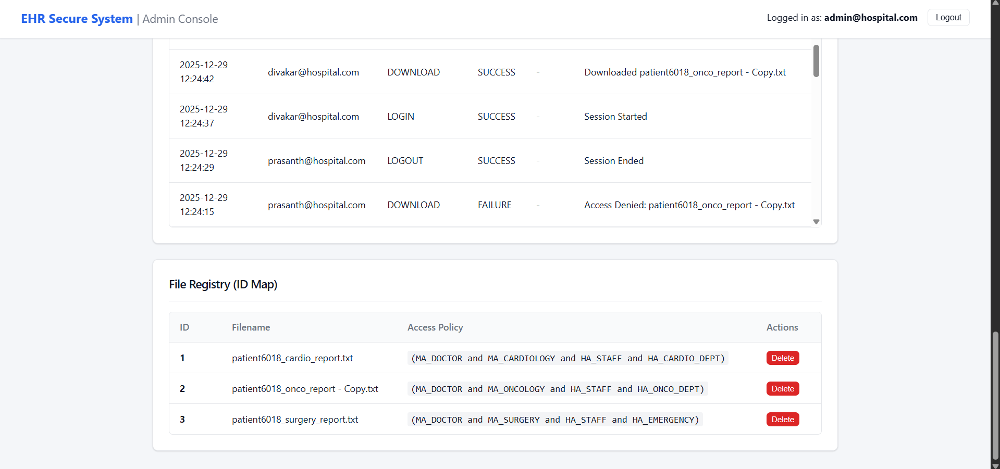
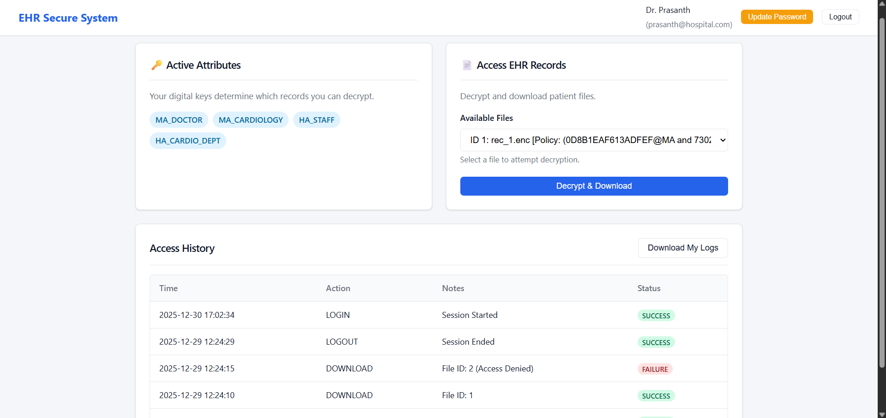

# EHR Access Management System (MA-ABE + AI-Powered Security)

## 1. Project Title
**Secure EHR Sharing & Access Control using Multi-Authority Attribute-Based Encryption (MA-ABE) with AI-Driven Anomaly Detection**

---

## 2. Overview / Abstract
This project implements a next-generation **Electronic Health Record (EHR) Access Management System** that combines advanced cryptography with Machine Learning to ensure data privacy and system integrity.

Traditional access control models (like RBAC) often fail to address the complexity of cross-organizational healthcare sharing and internal threat detection. This system utilizes **Multi-Authority Attribute-Based Encryption (MA-ABE)** to decentralize trust, allowing granular access policies (e.g., "Doctor AND Cardiologist"). Furthermore, it integrates an **AI/ML Engine** to monitor user behavior in real-time, detecting and flagging anomalous activities to prevent unauthorized data exfiltration.

**Key Objectives:**
* **Data Confidentiality:** EHR data is encrypted at rest; even the database administrator cannot read it without the correct cryptographic attributes.
* **Intelligent Threat Detection:** AI algorithms analyze access logs to detect suspicious behavior (e.g., mass downloads, off-hour access).
* **Role-Segregated UX:** A unified login system with distinct, secure dashboards for Administrators and Medical Staff.
* **Decentralized Trust:** Users obtain attribute keys from multiple independent authorities (Medical Authority, Hospital Authority).

---

## 3. Key Features

### Cryptographic & Core Features
* **Multi-Authority Key Management:** Simulation of independent authorities (Medical & Hospital) issuing cryptographic keys using the **RW15 Scheme**.
* **Attribute-Based Encryption (ABE):** Data is encrypted with access policies embedded directly into the ciphertext (e.g., `(MA_DOCTOR and HA_SURGEON)`).
* **Hybrid Encryption:** Uses AES-256 for efficient file encryption and MA-ABE for securing the AES keys.
* **Persistent Key Storage:** Attribute keys and Global Parameters are securely serialized and stored, ensuring system state survives server restarts.

### AI & Security Features
* **AI-Driven Anomaly Detection:** An integrated Machine Learning module monitors system logs to detect two specific types of anomalies:
    1.  **Behavioral Anomalies:** Repeated access denials or unusual high-frequency download attempts.
    2.  **Contextual Anomalies:** Access attempts occurring at irregular times or deviations from standard user patterns.
* **Real-Time Security Alerts:** The Admin Dashboard displays "Security Alerts" and "Frozen Accounts" triggered by the AI engine.

### User Experience Features
* **Unified Single Login:** A single secure entry point that authenticates users and automatically redirects them to the appropriate dashboard based on their role.
* **Dual Dashboards:**
    * **Admin Console:** For key issuance, user management, revocation, and monitoring AI alerts.
    * **User Workspace:** For medical staff to decrypt, download, and view patient records based on their attributes.
* **Audit Logging:** Tamper-evident logging of all actions (Register, Issue, Upload, Download, Revoke) with status tracking.

---

## 4. System Architecture
The system follows a modular client-server architecture enhanced with an ML layer:

* **Frontend (Client):** A responsive Web UI built with HTML5, CSS3, and JavaScript. Features distinct layouts for Admin and User views.
* **Backend (Server):** Python Flask application handling API requests, session management, and routing.
* **Cryptographic Engine:** A dedicated core module (`abe_core.py`) implementing the **Rouselakis-Waters 2015 (RW15)** MA-ABE scheme using `charm-crypto`.
* **AI/ML Engine:** A Python-based module using `scikit-learn` to process audit logs and identify outlier events.
* **Database & Storage:**
    * **SQLite:** Stores user profiles, serialized keys, encrypted file blobs, and audit logs.
    * **File System:** Persists global cryptographic parameters and authority keys for system stability.

---

## 5. Tech Stack
* **Language:** Python 3.x
* **Backend Framework:** Flask
* **Database:** SQLite (via SQLAlchemy)
* **Cryptography:**
    * `charm-crypto` (Pairing-based cryptography)
    * `PyCryptodome` (AES-256)
* **Machine Learning:** `scikit-learn`, `pandas`, `numpy` (Isolation Forest / Statistical Analysis)
* **Frontend:** HTML5, CSS3, JavaScript (Fetch API)

---

## 6. Project Workflow

1.  **Unified Login:** Users (Admins or Doctors) log in via the main portal. The system verifies credentials and redirects:
    * *Admins* $\rightarrow$ Admin Console.
    * *Users* $\rightarrow$ User Workspace.
2.  **Key Issuance (Admin):** The Admin selects an Authority (MA or HA) and issues attribute keys (e.g., `MA_DOCTOR`) to a specific user GID.
3.  **Secure Upload (User):** A Data Owner selects a patient file and defines an access policy. The system performs Hybrid Encryption (AES + ABE) and stores the file.
4.  **Access Request (User):** A doctor attempts to download a file. The system checks if their possessed keys satisfy the file's encryption policy.
5.  **AI Monitoring (Background):** Every action is logged. The ML model analyzes these logs in real-time.
    * *Scenario A:* Normal access $\rightarrow$ Allowed.
    * *Scenario B:* Anomaly detected (e.g., 5 failures in 1 minute) $\rightarrow$ Account flagged/frozen & Admin alerted.
6.  **Revocation (Admin):** Admins can revoke specific attributes or freeze accounts based on AI alerts.

---

## 7. Installation & Setup

### Prerequisites
* Python 3.8+
* C Compiler (for `charm-crypto`)
* GMP and PBC libraries

### Steps
1.  **Clone the Repository:**
    ```bash
    git clone [https://github.com/S-Prasanth-1511/Secure-EHR-System.git](https://github.com/S-Prasanth-1511/Secure-EHR-System.git)
    cd Secure-EHR-System
    ```

2.  **Create Virtual Environment:**
    ```bash
    python -m venv venv
    source venv/bin/activate  # Windows: venv\Scripts\activate
    ```

3.  **Install Dependencies:**
    ```bash
    pip install -r requirements.txt
    ```

4.  **Reset System (Optional Hard Reset):**
    If you need a fresh start (clears DB and Keys):
    ```bash
    rm instance/app.db
    rm -rf crypto_storage/
    rm authority_keys.bin
    ```

5.  **Run the Application:**
    ```bash
    python -B run.py
    ```

6.  **Access the System:**
    Open `http://127.0.0.1:5000` in your browser.

---

## 8. Usage Guide

### A. Admin Actions
1.  **Register Users:** Create accounts for doctors, nurses, or staff.
2.  **Issue Keys:** Grant cryptographic attributes (e.g., `CARDIOLOGY`) to users.
3.  **Monitor Security:** Check the dashboard for "System Health" or "Frozen Accounts" triggered by the AI.
4.  **Revoke Access:** Remove attributes from users who no longer need them.

### B. User Actions
1.  **Upload Records:** Upload EHR files with specific policies (e.g., `(MA_DOCTOR and HA_ER)`).
2.  **Decrypt & Download:** View available files. If your attributes match the policy, the "Decrypt" button will download the file.
3.  **View History:** Track your own access logs in the dashboard.

---

## 9. Security Model

### Multi-Authority ABE (RW15)
* **Decentralization:** No single Key Generation Center (KGC) controls the whole system.
* **Collision Resistance:** A user cannot combine their keys with another user's keys to hack the system.

### AI Anomaly Detection Logic
The system uses an unsupervised learning approach (or statistical heuristics) to detect:
1.  **Frequency Spikes:** Users attempting to download more files than the threshold within a sliding window ($T$).
2.  **Policy Violations:** Repeated `ACCESS_DENIED` events indicating a user is trying to guess policies or access unauthorized data.

---

## 10. Limitations
* **Prototype Implementation:** The "Authorities" are logically separated but run on the same physical server for demonstration.
* **AI Training:** The anomaly detection model is pre-configured for demonstration sensitivity; in a real-world scenario, it would require a larger dataset to reduce false positives.

---

## 11. Screenshots

### Unified Login Page


### Admin Dashboard & AI Alerts






### User Workspace (Decryption)


## 12. License
This project is open-source and available under the **MIT License**.

---

## 13. Acknowledgements
* **Charm-Crypto Library** for ABE implementation.
* **Flask** for backend infrastructure.
* **Scikit-Learn** for the anomaly detection engine.